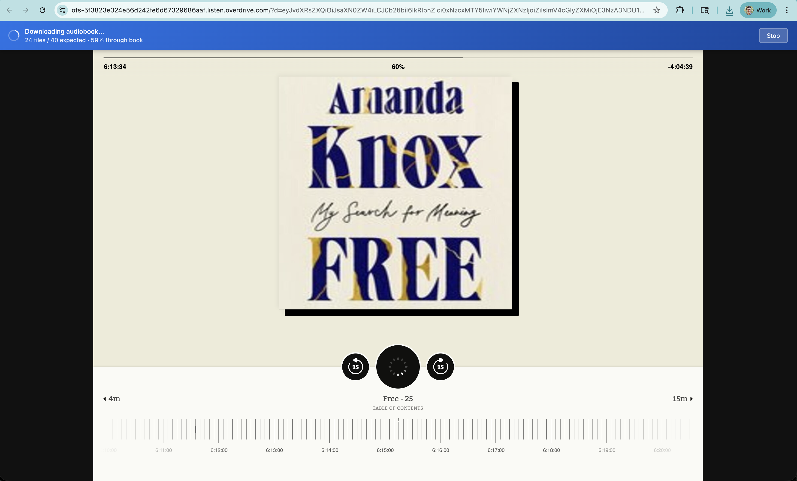
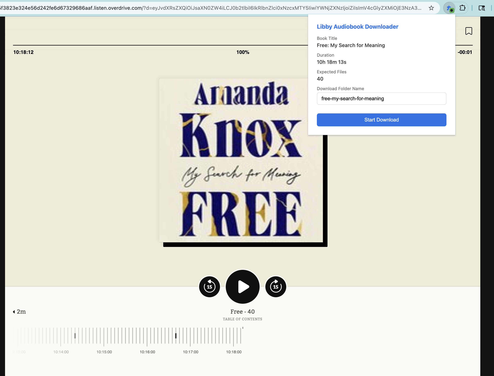
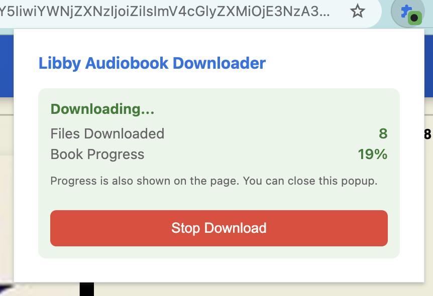

# Libby Audiobook Downloader

A Chrome extension to download audiobooks from Overdrive/Libby for offline listening.



## Installation

### For End Users

1. Download or clone this repository
2. Open Chrome and navigate to `chrome://extensions/`
3. Enable **Developer mode** (toggle in the top right corner)
4. Click **Load unpacked**
5. Select the `libby-web-fetch` folder

The extension icon will appear in your toolbar. It shows a green dot when you're on a compatible Libby audiobook page.

### Updating the Extension

When you pull new changes, reload the extension in Chrome:

1. Open `chrome://extensions/`
2. Find **Libby Audiobook Downloader** and click the refresh icon (↺)
3. Refresh any open Libby tabs to pick up content script changes

## Usage

1. Open [Libby](https://libbyapp.com) and navigate to an audiobook you have checked out
2. Open the audiobook player (URL will be like `*.listen.overdrive.com` or `libbyapp.com/open/loan/...`)
3. Click the extension icon in your toolbar



4. Review the book details:
   - **Book Title**: Detected from the page
   - **Duration**: Total audiobook length
   - **Expected Files**: Number of audio files (parts) in the book
   - **Download Folder Name**: Customize if desired

5. Click **Start Download**

The extension will:
- Restart the audiobook from the beginning
- Automatically scrub through the book (advancing 15 seconds at a time)
- Download each audio file as it's requested

### Progress Tracking

Progress is shown both in the popup and in a banner at the top of the page:



The on-page banner lets you close the popup and continue browsing while the download runs. It shows:
- Number of files downloaded vs. expected
- Percentage through the book
- A stop button to cancel

### Downloaded Files

Files are saved to your Downloads folder in a subdirectory named after the book:

```
~/Downloads/free-my-search-for-meaning/
  ├── free-my-search-for-meaning-001.mp3
  ├── free-my-search-for-meaning-002.mp3
  ├── free-my-search-for-meaning-003.mp3
  └── ...
```

## How It Works

The extension works by intercepting the audio file requests that the Libby player makes:

1. **Content Script** (`src/content.js`): Runs on Libby pages, extracts book metadata, and controls the player to scrub through the audiobook
2. **Background Service Worker** (`src/background.js`): Intercepts network requests to audio CDN domains and triggers downloads
3. **Popup** (`popup.html`, `src/popup.js`): User interface for starting/stopping downloads

The audio files are served from Overdrive's CDN with signed URLs that don't require additional authentication once you have a valid library loan.

## Development

### Prerequisites

- Node.js (for type checking)
- pnpm (or npm/yarn)

### Setup

```bash
# Install dependencies (optional, only needed for type checking)
pnpm install
```

### Project Structure

```
libby-web-fetch/
├── manifest.json      # Extension manifest (MV3)
├── popup.html         # Popup UI
├── src/
│   ├── background.js  # Service worker - intercepts requests, manages downloads
│   ├── content.js     # Content script - controls Libby player
│   └── popup.js       # Popup logic
├── icons/             # Extension icons (SVG)
└── images/            # Screenshots for README
```

### Making Changes

1. Edit files in `src/` (plain JavaScript with JSDoc type annotations)
2. Reload the extension in `chrome://extensions/` (click the refresh icon)
3. Refresh the Libby page to pick up content script changes

### Type Checking

The project uses JSDoc annotations for TypeScript-style type checking without a build step:

```bash
pnpm run check
```

### Key Files

- **`manifest.json`**: Defines permissions, content scripts, and service worker
- **`src/background.js`**: 
  - Listens for audio requests via `chrome.webRequest`
  - Downloads files via `chrome.downloads`
  - Uses `chrome.declarativeNetRequest` to block duplicate requests
- **`src/content.js`**:
  - Extracts book info from `window.BIF` (Libby's internal state)
  - Automates the player (restart, advance 15 seconds)
  - Displays progress banner on the page

## Troubleshooting

### Downloads not starting
- Make sure you're on an audiobook player page (`*.listen.overdrive.com` or `libbyapp.com/open/loan/...`)
- Try refreshing the page and restarting the download

### Missing files
- The extension shows expected vs. actual file count
- Some books may have slightly different counts due to how chapters are split

### Duplicate files
After download, you can remove duplicates with:
```bash
cd ~/Downloads/your-book-folder
md5 -r *.mp3 | sort | uniq -w32 -d | cut -d' ' -f2 | xargs rm
```

## License

MIT
